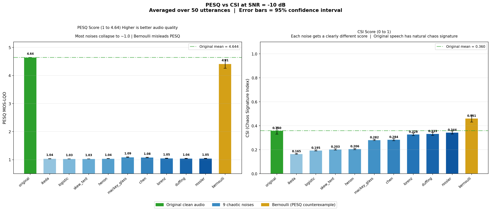

# Chaos-Aware Speech Quality Evaluation Metric
**CSI (Chaos Signature Index)** is a designed evaluation metric that captures nonlinear/chaotic dynamics in speech signals — dimensions that conventional metrics (PESQ, STOI, NISQA) do not capture. For this analysis, the phase space reconstruction of 1D speech signal was done with optimal manifold and time delay with False Nearest Neighbors (FNN) and (Average Mutual Information) AMI algorithms implementing Taken's Theorem. 
## Metric
CSI combines four nonlinear dynamics features:
- Permutation Entropy (PermEn)
- Correlation Dimension (D2)
- Sample Entropy (SampEn) &
- Recurrence Rate (RQA)
All features normalized so to understand the variation in deterministic chaos structure
## Dataset & Experiment
- **Base data:** 50 LibriSpeech `test-clean` utterances (longest files by duration)
- **Noise injection:** 10 chaotic noise systems — Logistic, Skew Tent, Hénon, Bernoulli, Ikeda, Lorenz, Rössler, Chen, Mackey-Glass, Duffing
- **SNR levels:** -10, -5, 0, 5, 10 dB
- Full grid: every utterance × noise type × SNR level processed and scored
### Absolute Topological Mapping
Evaluating metric behavior at maximum degradation (-10 dB SNR) exposes the limitations of linear acoustic scoring.

* **The PESQ Blind Spot:** The industry-standard metric grades heavily corrupted Bernoulli noise at 4.41, nearly identical to the 4.64 clean speech baseline. Linear algorithms cannot detect discrete binary jumps.
* **CSI Gradient Separation:** The Chaos Signature Index maps structural corruption accurately. It distributes the continuous chaotic systems along a distinct numerical gradient, ranging from 0.165 to 0.344.
* **Anomaly Rejection:** Natural speech established a stable baseline at 0.360. Enforcing a biological constraint penalty on extreme permutation entropy successfully suppressed false recurrence clusters. This forced the impossible phase-space geometry of the Bernoulli noise out to 0.461, preventing a false positive.
